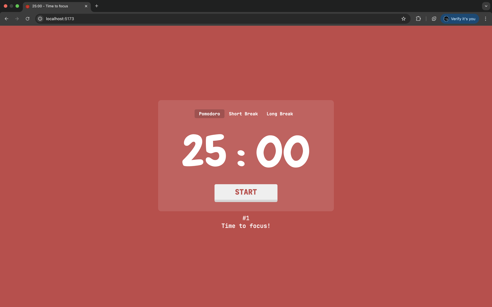
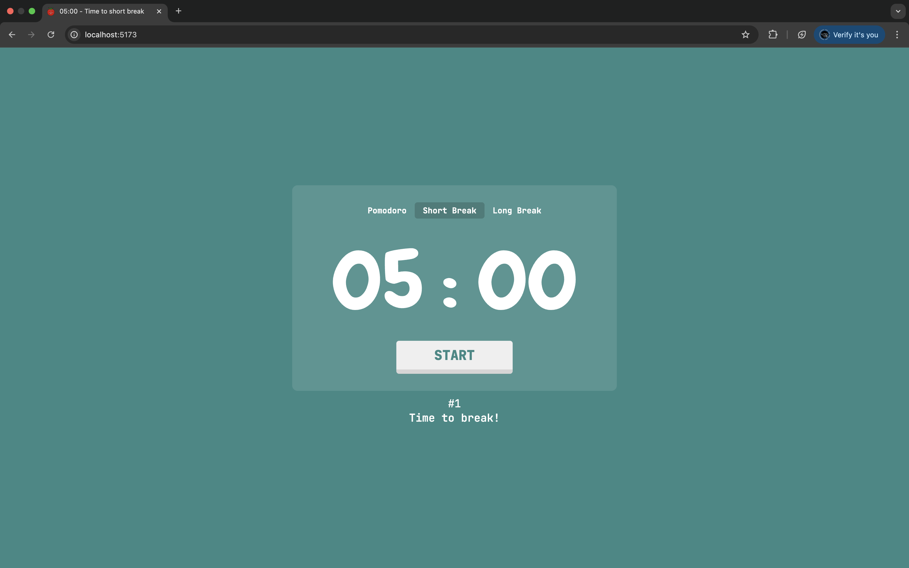
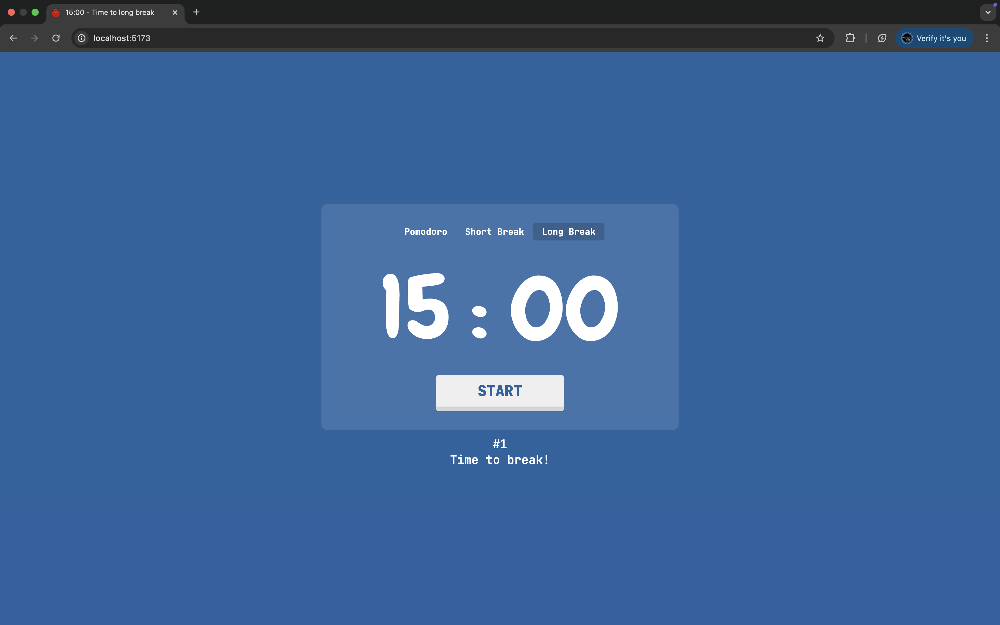

# SIMPLE POMODORO 
A simple pomodoro timer for study use Bun runtime 

# INSTALLATION
1. clone the repo
```
git clone https://github.com/Nguyen-Dang-Khoa-04072004/Pomodoro-Timer.git
```
2. install depedencies
```
bun install
```
3. run the pomodoro timer
```
bun run dev
```
# SCREENSHOTS




# DEMO

